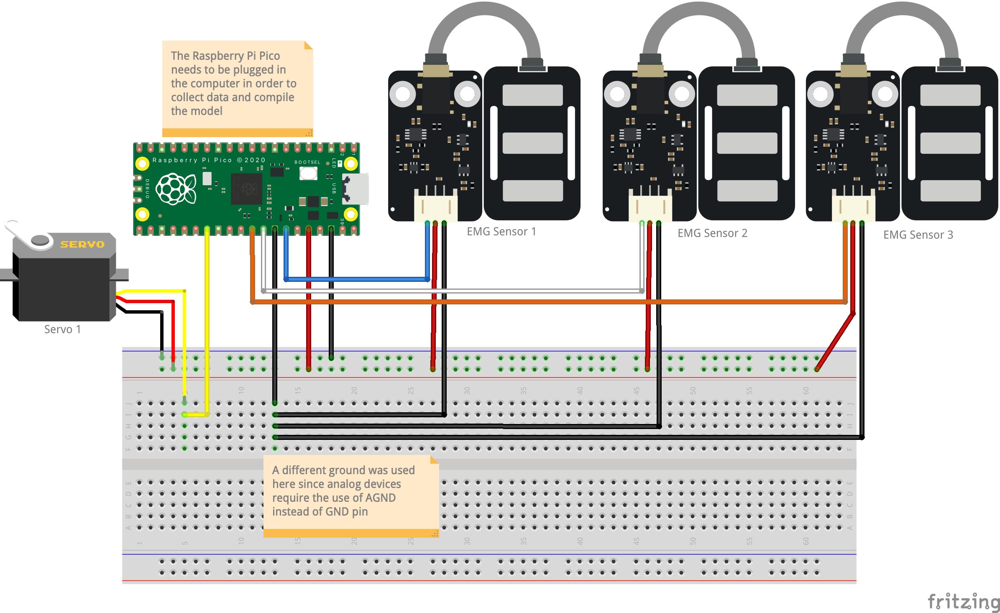

# DevilArm

This repo contains all of the source code for the DevilArm, which is a prosthetic arm for transradial amputees (amputation just below the elbow).

## Setup

1. Install [`rustup`](https://www.rust-lang.org/)
2. Install `thumbv6m-none-eabi` target with `rustup target add thumbv6m-none-eabi`
3. Install `elf2uf2-rs` with `cargo install elf2uf2-rs --locked`
4. Install `probe-rs` with `cargo install probe-rs --features=cli --locked`

## Architecture

The repo is split into 3 seperate sections.

1. `devil-embedded`
    - This is the code which runs on the Raspberry Pi Pico, it runs predictions using the infer function from the devil-ml crate. After each prediction it displays a gesutre, depending on the output.
2. `devil-ml`
    - This contains the machine learning model's defintion. It can be run in any environment. It contains a training function which can be run with `cargo run` in that directory.
3. `devil-trainer`
    - This calls `devil-ml` to train the model, and deploys `devil-embedded` to the microcontroller. Built with Tauri, which is downloadable by anyone as an app on Windows, Macos, and Linux. Mainly used for rapid prototyping

Other than these three, there exists the [`DevilMechanicalTester`](https://github.com/Devils-Prosthetics/DevilMechanicalTester/) which is used by the mechanical team to test the servos.

## Wiring Diagram

This is the wiring diagram for the Raspberry Pi Pico (should be updated to reflect the actual pins used by `devil-embedded`).
